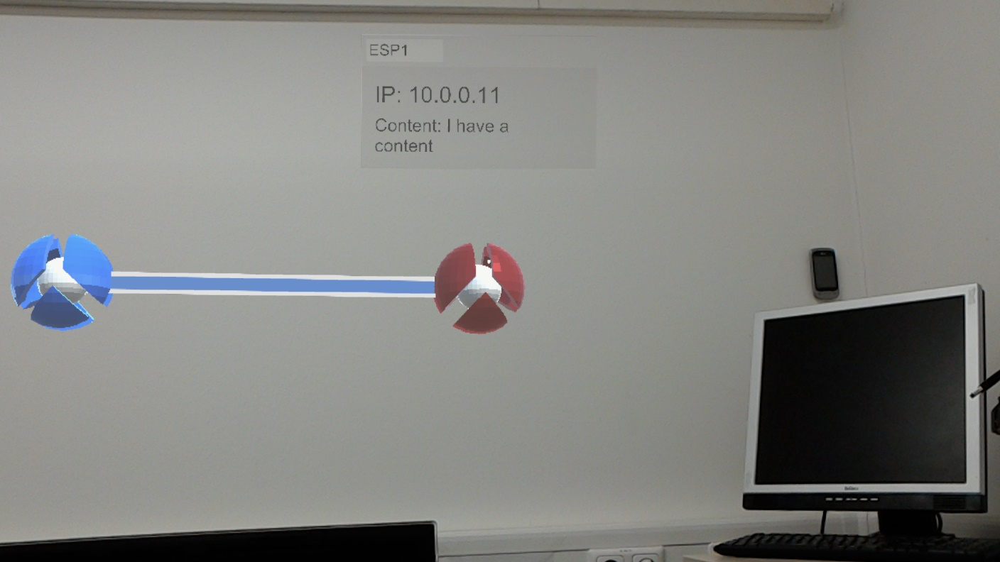

# NetworkVisualizer

 
  

This software visualizes network data with the Microsoft HoloLens in a specific environment.

## Main Functionalities:

- Track and visualize network object
- Scan connections and react accordingly
- visualize network connection and requests and responses

## Todo list:

### Refactoring:

Device -> Node
Connections generischer
usw...

### Echtzeitvisualisierung

* Jede Verbindung anzeigen 
* Wenn eine Verbindung oder Gerät ausgewählt wird, ständiges Update

### Überblicksvisualisierung (Nach der Echtzeitvisualisierung)

* Schieberegler
* Eventuell Änderungen an den gerätespezifischen Daten dokumentieren und hier auch jeweils darstellen 

### Ideen für Visualisierung:

Particle System mit Trails
